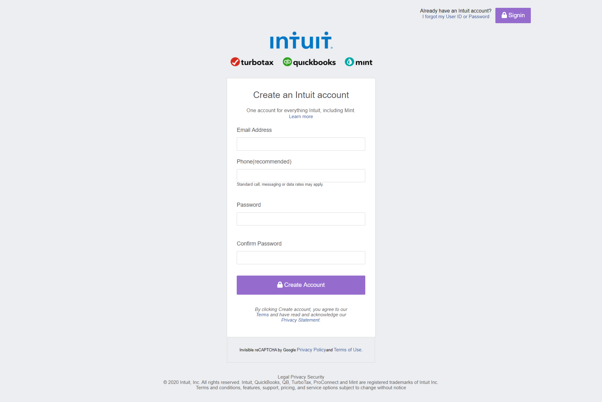

# HTML and CSS Signup form

> This our second project in microverse,a sample signup form  

## Built With

- HTML
- CSS
- CSS grid and Flex
- No framework

## Live Demo

[Live Demo Link](https://ahzia.github.io/HTML-Signup-Form/)

## Getting Started

1. Clone the project 
  `$ git clone https://github.com/ahzia/HTML-Signup-Form
2. Then open index.html in your browser

To get a local copy up and running follow these simple example steps.

### Prerequisites

Just ensure you have one or more web browsers

## Authors

👤 **Author1**

- GitHub: [@ahzia](https://github.com/ahzia)
- Twitter: [@ZiaYousofi](https://twitter.com/ZiaYousofi)
- LinkedIn: [LinkedIn](https://https://www.linkedin.com/in/ah-ziayosfi)

👤 **Author2**

- GitHub: [@pacyL2K19](https://github.com/pacyL2K19)
- Twitter: [@PacifiqueLinja1](https://twitter.com/PacifiqueLinja1)
- LinkedIn: [LinkedIn](https://www.linkedin.com/in/pacifique-linjanja-2a565517b/)

## 🤝 Contributing

Contributions, issues, and feature requests are welcome!
Feel free to contribute 
Feel free to check the [issues page]().

## Show your support

Give a ⭐️ if you like this project!

